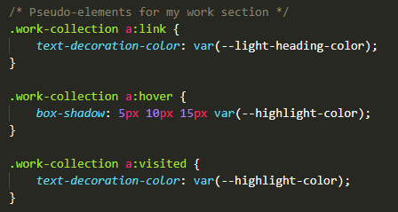

# Web-application-portfolio

## About the project

This project required the creation of a web application from scratch--no starter code--to build a portfolio page. The aim of building this portfolio page is so that it can be added to as more web applications and projects are created throughout this course.

The user story was:

```
AS AN employer
I WANT to view a potential employee's deployed portfolio of work samples
SO THAT I can review samples of their work and assess whether they're a good candidate for an open position
```

There was also a number of acceptance criteria that needed to be met. This included presenting my name, a recent photo, and links to each section; the UI to scroll when a link to a section of the website was selected (in particular, the link to the 'My Work' section); the first application being larger in size than the others; each portfolio link deploying the user to that web application; and a responsive layout.

Since this is only our second assignment and we're required to show a number of portfolio pieces within this web application for this project, I have included a few placeholder tiles (titled 'placeholder portfolio work #'), but will add more applications as I create them throughout this bootcamp. Due to this, I have also provided placeholder links, which link back to the same web application.

This is also the case for the resume link. However, this will include a PDF link to a final resume in future as the course continues.

> The final project can be found at: https://chardige.github.io/Web-application-portfolio/

> The final HTML and CSS can be found at: https://github.com/CharDige/Web-application-portfolio

## The process - how I approached this project

### Wireframe

After creating the GitHub repository and pushing through my initial commit of the HTML and CSS, I quickly planned out a basic wireframe for how I wanted my web application to flow. I wanted to make sure it wasn't too complicated to look at and used a good amount of white space.


### Head

After completing the wireframe, I mapped out my process to focus on each section separately.

First, I filled out the required `DOCTYPE`, `HTML`, and `head`, then included an empty `body` element. While filling out the `head` element, I also linked a basic reset.css file I put together, plus linked the empty style.css file.


I initially wanted to attempt each acceptance criteria separately as a checklist. However, I realised quickly that there was quite a bit I needed to create in the HTML and CSS first to start the process. Therefore, I decided to break down the task by each HTML element and work on each as I went.

### Header

Focussing on the `header` element first, I created the navigation structure in the HTML, and then begun the inital styling for the `header` and `nav`. This then followed with a `figure` as my hero image and the styling that came with this.

I then worked on a couple of Media Queries for a responsive navigation, having a few troubles to begin with. However, with a little bit of initial research, I found the HTML and CSS properties I required.


### CSS Variables

I wanted the colours throughout my web application to match the colours in the figure image. As green is my favourite colour, I also wanted to make sure this was prominent but not overwhelming throughout the web application. I identified the hex colours for some aspects of the hero image and included these as CSS variables. I also included a `font-family` and `body-margin` in my CSS variables, which were decisions I made later on during this process.

I then incorporated some of these CSS variables into the `::selection` CSS property later in the process.


### Sections

For the 'About me' and 'Contact me' sections, I used `Lorem Ipsum` placeholder text in `p` tags, and then I styled these sections as how I wanted them to look before I spent time on the text later on.

A majority of my time was spent on the 'My Work' section. This included building the HTML and the responsive CSS properties. Halfway through the process, I realised I hadn't included a class properly in the HTML, which completely changed how my web application looked, so I spent quite a bit of time back-tracking at this point to get the web application looking like how I wanted to.

For the featured work, I used the week 1 project hero image and linked the tile to the deployed application, making it so it opened into a new tab as well. For the other four tiles, I used images I'd taken for personal projects (not web development related) and then used placeholder text and links to ensure the functionality was there for the project.

It took me a bit of time to figure out the best way to display my portfolio work tiles and to find the right CSS properties I needed to use. My biggest challenge was creating the responsive design with this section. Eventually, I had established the CSS properties and HTML structure I needed, and added in pseudo-elements to add in a little extra to the design and functionality of the web application.

Below are a couple of screenshots of the HTML and CSS:

**Part of the 'My Work' HTML**


**Part of the CSS for the 'My Work' section**


**Pseudo-elements**



**Media Queries**


I then spent time adding content into the 'About Me' and 'Contact Me' sections, as well as including pseudo-elements in the 'Contact Me' section.

### Footer

I kept the `footer` element very simple, leaving it as a copyright section with my name and the year. I then styled it to be similar as the `header`.

## Final


This can also be viewed at this link: https://chardige.github.io/Web-application-portfolio/

And, the HTML and CSS can be viewed in the GitHub repository: https://github.com/CharDige/Web-application-portfolio

## Challenges

I had quite a few challenges throughout this project, including organising the CSS properties in a way that made the web application responsive, and with using the `position` CSS property with the text in front of the images for each portfolio tile.

There were a number of resources (referenced in the Credits section below) that I referred to that really helped me with using `flexbox`, `position` and more. I also found using Google Dev Tools really helpful with playing with solutions as I found them online to see if they helped solve some of the problems I encountered.

One of the biggest challenges was having to back-track after not putting the right class to the right `div` element. This was missing the `main-box` class in the 'My Work' section, which then impacted a lot of the styling that I had worked on for a few hours. However, with a lot of patience and taking each step slowly, I was able to overcome this challenge.

## What I learnt

I have learnt a lot about using `div` elements in HTML and have felt myself become really confident in using a number of basic and advanced CSS properties.

At first, I was really hesitant in using `div` elements in my HTML as I knew that using too many could make the HTML look messy. However, once I realised how important they were in applying CSS and I became more confident in using CSS, I realised that `div` elements aren't anything to be worried or afraid about!


## Credits

I referred to a number of websites throughout this assignment to create my final web application. I have provided references to these pages below:

Coyier, C. (2022, February 20), *A Complete Guide to Flexbox*, CSS-Tricks, https://css-tricks.com/snippets/css/a-guide-to-flexbox/

W3 Schools (2022), *CSS Margins*, W3 Schools, https://www.w3schools.com/css/css_margin.asp

W3 Schools (2022), *How TO - Responsive Top Navigation*, W3 Schools, https://www.w3schools.com/howto/howto_js_topnav_responsive.asp

W3 Schools (2022), *How TO - Position Text Over an Image*, W3 Schools, https://www.w3schools.com/howto/howto_css_image_text.asp

W3 Schools (2022), *How TO - Text Blocks Over Image*, W3 Schools, https://www.w3schools.com/howto/howto_css_image_text_blocks.asp

W3 Schools (2022), *CSS Media Queries*, W3 Schools, https://www.w3schools.com/css/css3_mediaqueries.asp

W3 Schools (2022), *CSS position Property*, W3 Schools, https://www.w3schools.com/cssref/pr_class_position.asp

W3 Schools (2022), *Responsive Web Design - Images*, W3 Schools, https://www.w3schools.com/css/css_rwd_images.asp

W3 Schools (2022), *How TO - Align Images Side By Side*, W3 Schools, https://www.w3schools.com/howto/howto_css_images_side_by_side.asp

W3 Schools (2022), *CSS text-decoration-color Property*, W3 Schools, https://www.w3schools.com/cssref/css3_pr_text-decoration-color.asp

Rendle, R (2016, February 19), *A Quick Overview of 'object-fit' and 'object-position'*, CSS-Tricks, https://css-tricks.com/on-object-fit-and-object-position/


## License

MIT License

Copyright (C) 2022 Charlotte Dige